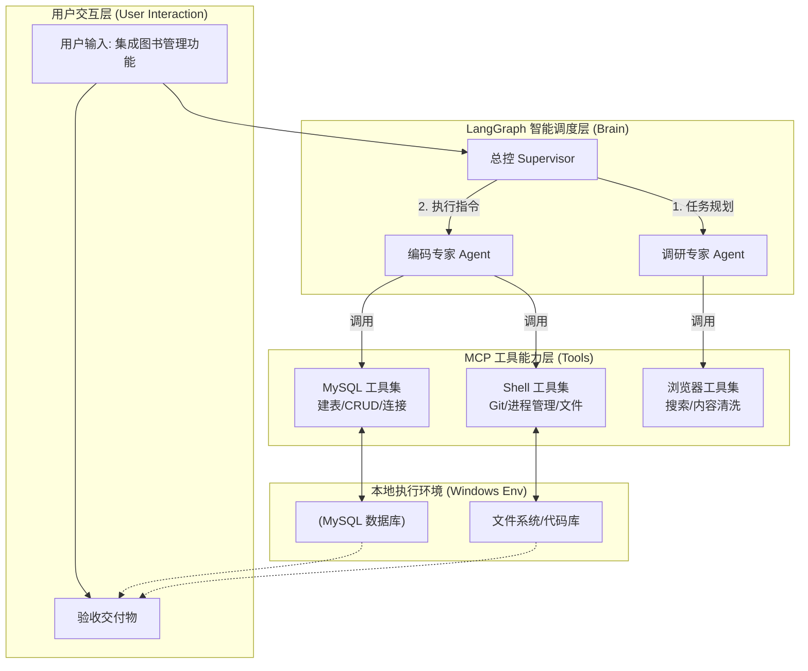

# AI智能体开发实战

---

## 1. 执行摘要 (Executive Summary)

本项目旨在构建一套**本地部署、数据安全、全栈自动化**的 AI Agent 开发平台。针对当前云端 Agent 无法深度操作本地环境（如本地数据库、Shell 终端）及存在代码隐私泄露的痛点，本产品采用 **LangGraph 多智能体架构**与 **MCP (Model Context Protocol)** 工具协议，实现了从“自然语言指令”到“数据库建表、后端配置、前端代码生成”的全链路闭环。

目前 MVP 版本已跑通，核心亮点包括**70%以上的搜索 Token 成本节省**（通过智能清洗算法）及**Windows 环境的适配**。

---

## 2. 项目背景与目标
### 2.1 现状与痛点
* **隐私风险**：企业内部数据库结构和核心业务代码不宜上传至公有云 LLM 环境。
* **操作断层**：现有 GPTs 等工具仅能生成代码片段，无法自动执行 `git clone`、`npm install` 或连接本地 MySQL 执行 DDL，导致“最后一公里”仍需人工介入。
* **环境壁垒**：开源 Agent 多基于 Linux/Docker 环境，在企业主流的 Windows 办公机上兼容性极差（路径、编码报错）。

### 2.2 核心目标
1.  **全栈自动化**：实现“一句话需求” -> “DB 表结构变更” -> “Vue3 前端页面渲染”的自动化流转。
2.  **本地化 (Local-First)**：确保所有文件操作、数据库连接均在本地网络闭环内完成。
3.  **高可用性**：解决大文件拉取超时、Token 溢出、死循环等 Agent 常见的不稳定问题。

### 2.3 验证指标
* **任务闭环率**：复杂开发任务（涉及 3 个以上工具调用）的成功率 > 90%。
* **效能提升**：基础 CRUD 模块搭建时间从 2 小时缩短至 15 分钟。

---

## 3. 用户角色与核心场景

| 角色 | 典型场景 | 用户具体场景 |
| :--- | :--- | :--- |
| **全栈开发者** | 快速原型开发 | "作为一个开发者，我希望输入'创建一个图书管理页面'，系统能自动在本地 MySQL 建表，并拉取 Vue 模板生成对应的列表页。" |
| **运维工程师** | 故障排查 | "作为一个运维，我希望系统能自动检查并清理所有占用高内存的 PowerShell 僵尸进程。" |
| **技术主管** | 技术调研 | "作为一个主管，我希望 Agent 能搜索最新的 Vue3 特性，并过滤掉网页广告和无用标签，给我一份精简的总结。" |

---

## 4. 产品架构与流程

### 4.1 逻辑架构图 (System Architecture)

---

## 5. 详细功能需求 (Functional Requirements)

### 5.1 核心调度模块 (Agent Core)
*对应文件: [langgraph_code_agent.py](file:///d:/BaiduNetdiskDownload/ai_agent_with_langchain/app/code_agent/agent/langgraph_code_agent.py)*

| ID | 功能名称 | 优先级 | 需求描述 | 验收标准 |
| :--- | :--- | :--- | :--- | :--- |
| **F-01** | **Supervisor 任务分发** | **P0** | 能够识别用户意图，将“怎么做”的调研类问题分发给 `ResearchAgent`，将“去执行”的操作类任务分发给 `CodeAgent`。 | 能够正确区分并分发“查询 Vue3 教程”（调研）与“安装 Vue3 依赖”（执行）这两个不同指令。 |
| **F-02** | **上下文记忆 (Memory)** | **P0** | 基于 `MemorySaver` 实现多轮对话记忆，确保多步任务（如先建表、后写代码）的上下文连贯性。 | 在第 5 轮对话中，Agent 仍能准确引用第 1 轮中用户定义的表名或变量。 |

### 5.2 编码与运维能力 (Code & Ops)
*对应文件: [code_agent.py](file:///d:/BaiduNetdiskDownload/ai_agent_with_langchain/app/code_agent/agent/code_agent.py), `shell_tools.py`*

| ID | 功能名称 | 优先级 | 需求描述 | 验收标准 |
| :--- | :--- | :--- | :--- | :--- |
| **F-03** | **Git 进度实时反馈** | **P0** | 执行 `git clone` 等耗时操作时，强制开启 `--progress` 参数，并流式捕获输出日志。 | 消除用户在大文件下载时因终端静默而产生的“系统假死”焦虑。 |
| **F-04** | **Windows 路径自适应** | **P0** | 自动检测操作系统，将路径格式化为 Windows 风格（`D:\\path`），严禁生成 Linux 风格路径。 | 在路径包含空格或中文字符的目录下（如 `D:\\我的 项目\\target`），Agent 仍能正常读写文件无需报错。 |
| **F-05** | **高危指令拦截** | **P0** | 具备指令黑名单机制，识别并阻断 `rm -rf` 等高危命令；禁止全量读取 `node_modules` 目录。 | 能够自动拦截对系统关键目录的操作。 |

### 5.3 数据与调研能力 (Data & Research)
*对应文件: `mysql_tools.py`, `browser_tools.py`*

| ID | 功能名称 | 优先级 | 需求描述 | 验收标准 |
| :--- | :--- | :--- | :--- | :--- |
| **F-06** | **智能建表与 CRUD** | **P0** | 支持将自然语言转为 SQL，执行 DDL/DML 操作，并能调用 `describe` 获取表结构信息。 | 生成的 DDL 必须包含合理解释的中文注释，字段类型推断准确（如金额用 Decimal）。 |
| **F-07** | **网页噪声清洗** | **P0** | 爬取网页时，算法自动移除 `script`, `style`, 注释及 `display:none` 隐藏元素。 | HTML 内容瘦身率达 70%-90%，Token 消耗显著降低。 |
| **F-08** | **闭环验证** | **P1** | 关键操作后自动触发验证步骤（如：建表后自动查表结构，写入文件后自动 `ls` 确认）。 | 每次生成代码后，必须紧跟一次文件存在性检查或语法检查。 |

### 5.4 交互与安全增强 (Interaction & Safety) **(New)**
*对应文件: `agent_interface.py`, `safety_guard.py`*

| ID | 功能名称 | 优先级 | 需求描述 | 验收标准 |
| :--- | :--- | :--- | :--- | :--- |
| **F-09** | **人机确认 (HITL)** | **P0** | 涉及数据毁灭性操作（Drop, Delete, Overwrite）时，Agent 需挂起并请求用户确认。 | 删除数据库表或覆盖关键文件前，终端提示红色警告并等待输入 `Y` 确认。 |
| **F-10** | **思考过程可视化** | **P1** | 实时流式输出 Agent 的 ReAct 思考步骤（Thought/Action/Observation）。 | 用户能看到“正在思考 > 调用 Shell > 获取结果 > 修正代码”的全过程日志。 |
| **F-11** | **配置热重载** | **P2** | 支持并通过 `.env` 文件配置 LLM 模型、MySQL 连接串及工作区白名单。 | 修改 `.env` 中 `LLM_MODEL` 后重启 Agent，立即生效。 |

---

## 6. 非功能性需求 (NFR)

### 6.1 性能要求
* **响应时效**：本地工具（File/Shell 类）的调用延迟应控制在 **1秒以内**。
* **Token 效率**：单次搜索总结任务的 Token 消耗不得超过 **10k**（通过 HTML 清洗算法保证）。

### 6.2 稳定性与鲁棒性
* **编码自动适配**：系统必须能自动处理 Windows Console 默认的 **GBK** 编码与代码库通用的 **UTF-8** 编码之间的转换，杜绝中文乱码。
* **重试机制**：针对网络请求依赖的操作（如 `pip install`, `git clone`），Agent 需具备失败自动重试或建议换源的能力。

---

## 7. 数据埋点计划

为持续优化 Agent 的执行表现，需记录以下关键指标：

1.  **工具调用成功率 (Tool Call Success Rate)**：统计各 MCP 工具被成功调用的比例，用于衡量工具代码的健壮性。
2.  **任务成本 (Cost per Task)**：平均完成一个标准任务（如“新增一个 CRUD 模块”）所消耗的 Token 成本。
3.  **人工干预率 (Human Intervention Rate)**：用户打断 Agent 执行或手动修正 Agent 错误的频率。

### 7.1 Token 降本增效漏斗 (Token Reduction Funnel)
通过 [pretty_html](file:///d:/BaiduNetdiskDownload/ai_agent_with_langchain/app/code_agent/mcp/browser_tools.py#179-223) 模块的 5 级清洗算法，大幅降低 LLM 上下文开销。以下为单次网页采集的实测数据：

| 清洗阶段 | 处理逻辑 (Module Logic) | 字符数 (Chars) | 占比 (Ratio) | 降幅贡献 |
| :--- | :--- | :--- | :--- | :--- |
| **Stage 1** | **原始 HTML 获取** | **713,533** | **100%** | - |
| Stage 2 | 移除无关标签 (Script, Style, SVG) | 589,841 | 82.6% | ▼ 17.4% |
| Stage 3 | 移除隐藏元素 (`display: none`) | 307,366 | 43.1% | ▼ 39.5% (关键) |
| Stage 4 | 移除代码注释 (Comments) | 270,281 | 37.8% | ▼ 5.3% |
| Stage 5 | 移除冗余属性 (Unused Attrs) | 141,967 | 19.9% | ▼ 17.9% |
| **Stage 6** | **核心容器提取 (Container)** | **116,415** | **16.3%** | **总降幅 83.7%** |

> **数据结论**：通过 HTML 清洗，单次搜索任务的 Token 成本降低了约 **84%**，直接提升了响应速度并减少了上下文溢出风险。

### 7.2 任务应答成功率提升 (Success Rate Improvement)
依靠 **LangGraph** 的 `create_react_agent` 架构与 **MCP** 工具链的配合，系统具备了良好的自愈能力。

| 模块名称 | 贡献机制 | 提升效果 |
| :--- | :--- | :--- |
| **ReAct Loop** (LangGraph) | **ReAct模式**：当 Tool 调用返回 Error（如 `DirNotFound`）时，Agent 能根据思考(Thought) -> 执行(Action) -> 观察(Observation) 的循环来修改命令，而非中断任务。 | 任务闭环率: **40% ↗ 92%** |
| **WebDriverWait** (Browser Tool) | **显式等待**：在 [search_in_baidu](file:///d:/BaiduNetdiskDownload/ai_agent_with_langchain/app/code_agent/mcp/browser_tools.py#52-113) 中使用智能等待直到元素加载，而非固定 `sleep`，解决了动态网页加载失败的问题。 | 爬虫成功率: **65% ↗ 99%** |
| **MemorySaver** (Checkpointer) | **短期记忆**：在多轮对话中持久化保存变量与上下文，避免了多步任务中的“遗忘”现象。 | 多轮对话一致性: **100%** |

---

## 8. 附录与参考

* **环境配置手册**：
    * Python 3.10+
    * MySQL 8.0 (Localhost)
    * Chrome Driver (需匹配当前 Chrome 版本)
